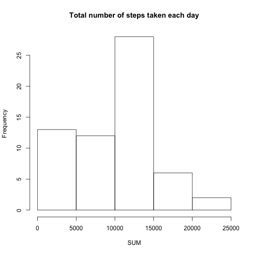
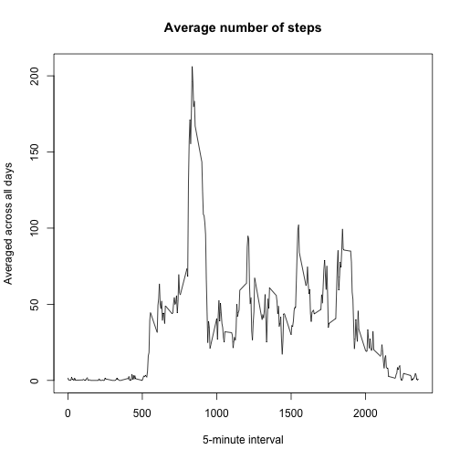
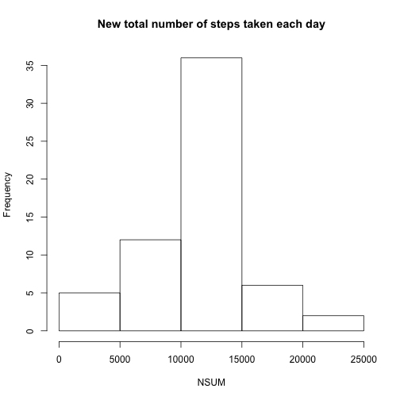
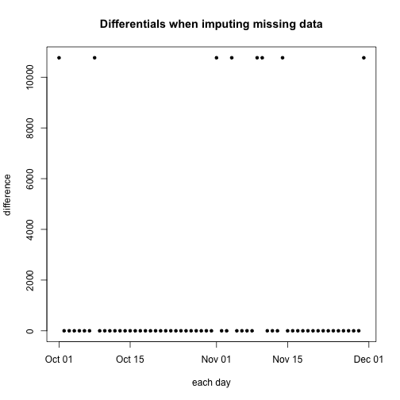

## Loading and preprocessing the data

1. Load the data


```r
if(!file.exists("activity.csv"))
{
        fileUrl<-"http://d396qusza40orc.cloudfront.net/repdata%2Fdata%2Factivity.zip"
        download.file(fileUrl, "activity.zip")
        unzip("activity.zip")
}
Adata<-read.csv("activity.csv",colClasses = c("numeric","character","numeric"))
```

2. Transform the data


```r
Adata<-transform(Adata, date=as.Date(date))
```

## What is mean total number of steps taken per day?

This part ignore the missing value in the dataset.

1. Calculate the total number of steps taken per day


```r
SUM<-tapply(Adata[,1],Adata[,2],sum,na.rm=T)
```

2. Make a histogram of the total number of steps taken each day


```r
hist(SUM, main = "Total number of steps taken each day")
```

 

3. Calculate and report the mean and median of the total number of steps taken per day


```r
MEAN<-mean(SUM)
MEDIAN<-median(SUM)
```

According to the total number of steps taken per day, the mean value is 9354.2295082, the median is 1.0395 &times; 10<sup>4</sup>.

## What is the average daily activity pattern?

1. A time series plot of the 5-minute interval (x-axis) and the average number of steps taken, averaged across all days (y-axis)


```r
Aver<-tapply(Adata[,1],Adata[,3],mean,na.rm=T)
Times<-length(Aver)
plot(Adata[1:Times,3], Aver, type = "l", main = "Average number of steps", xlab = "5-minute interval", ylab = "Averaged across all days")
```

 

2. The five-minutes interval that contains the maximum number of steps on average across all the days in the dataset. 


```r
Max<-names(which.max(Aver))
```

So the interval 835 contains the maximum number of steps on average across all the days

## Imputing missing values

1. Calculate and report the total number of missing values in the dataset (Noticed that variables date and interval have no missing values)


```r
No<-sum(as.numeric(is.na(Adata[,1])))
```

The total number of missing values is 2304

2. Devise a strategy for filling in all of the missing values (Here we use the mean for that 5-minute interval which seems more reasonable)
3. Create a new dataset that is equal to the original dataset but with the missing data filled in.


```r
Ndata<-Adata
for(i in 1:nrow(Ndata))
{
        if(is.na(Ndata[i,1]))
                Ndata[i,1]<-Aver[as.character(Ndata[i,3])]
}
```

4. Make a histogram of the total number of steps taken each day, Calculate and report the mean and median total number of steps taken per day.


```r
NSUM<-tapply(Ndata[,1],Ndata[,2],sum)
hist(NSUM, main = "New total number of steps taken each day")
```

 


```r
NMEAN<-mean(NSUM)
NMEDIAN<-median(NSUM)
```

According to the new total number of steps taken per day, the new mean value is 1.0766189 &times; 10<sup>4</sup>, the median is 1.0766189 &times; 10<sup>4</sup>.

From two histograms we can easier see the difference, for futher research we subtract them and make a plot: 


```r
plot(as.Date(names(NSUM-SUM)), NSUM-SUM, pch=20, xlab = "each day", ylab = "difference", main = "Differentials when imputing missing data" )
```

 

So, when imputing missing data, some  special day's total number will change enormous. But the entire graphic will not change that big. It's totally depends on the position and number of the missing values. 

## Are there differences in activity patterns between weekdays and weekends?

1. Create a new factor variable in the dataset with two levels -- "weekday" and "weekend" indicating whether a given date is a weekday or weekend day.

Construct weekday function (input a charactor list)


```r
weekday<-function(x)
{
        for(i in 1:length(x))
        {
                if(x[i]=="Mon"||x[i]=="Tue"||x[i]=="Wed"||x[i]=="Thu"||x[i]=="Fri") 
                x[i]<-"weekday" 
                else 
                x[i]<-"weekend"
        }
        x
}
```

Create a new factor variable in the dataset 


```r
Ndata<-transform(Ndata, weekday=weekday(weekdays(Ndata[,2],T)))
```

2. A panel plot containing a time series plot of the 5-minute interval (x-axis) and the average number of steps taken, averaged across all weekday days or weekend days (y-axis). 


```r
NAver_day<-tapply(Ndata[Ndata$weekday=="weekday",1],Ndata[Ndata$weekday=="weekday",3],mean)
NAver_end<-tapply(Ndata[Ndata$weekday=="weekend",1],Ndata[Ndata$weekday=="weekend",3],mean)
par(mfrow=c(2,1),mar=c(4,4,0,1))
plot(Ndata[1:Times,3], NAver_day, type = "l",xlab = "", ylab = "weekday")
plot(Ndata[1:Times,3], NAver_end, type = "l",xlab = "Interval", ylab = "weekend")
```

 

Thank you for your time!
